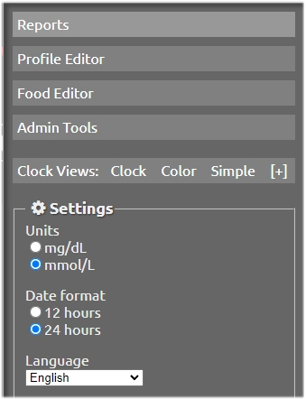
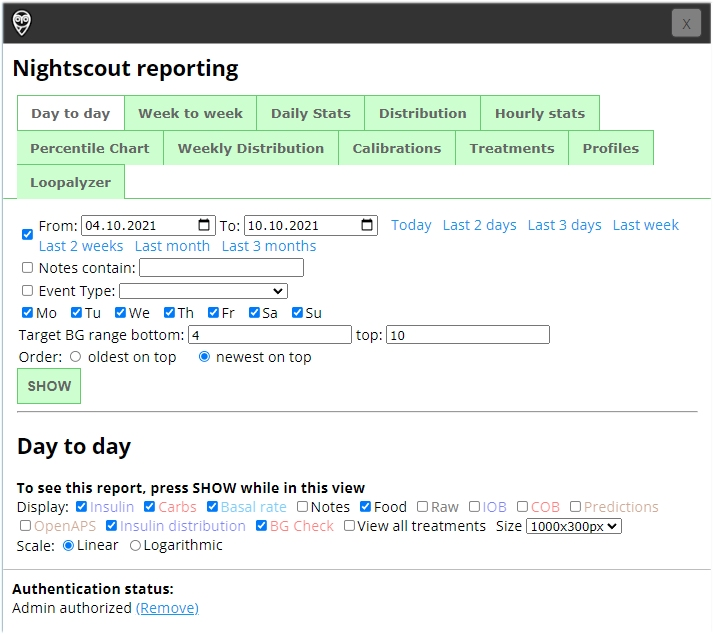

# Nightscout Reports

To access the "Reports" feature of Nightscout, just click on the the middle icon with 3 dashes in the right corner of your Nightscout window. This will open a menu offering to modify the visual content of Nightscout, but also to enter the Reports section.

On the top of the Menu list, select Reports

 

## Generate

Select an item from the various options, such as "Day to Day" or "Distribution", and the period for which you want to generate a report. Then press the SHOW button.

 
That's it. You can close to report by clicking on the **X** button on the top right corner of the window.

Next take a moment to [contact me](../contact.md) if you have questions or suggestions, or if you want to contribute in some way, thank you !  :smile: