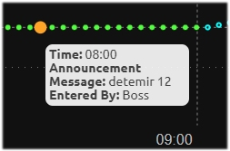

# Long acting insulin agonists

As there is no dedicated feature in Nightscout for declaring long-acting insulin injections, you will have to do it as an "Announcement" in Careportal.

## Announcements

When logging the injection in Careportal, select "Announcement" in the drop-down list. Again, check "Sensor", under Glucose Reading, so that the entry will be superimposed with the SGV curve. **The syntax for the entry is important, as CGMSIM is not very error-tolerant.**

In the "notes" field, please write down the selected insulin first, and then the number of units, separated by a single space. No need to add anything after like this:

The announced injection will appear as an orange dot on the SGV curve:

