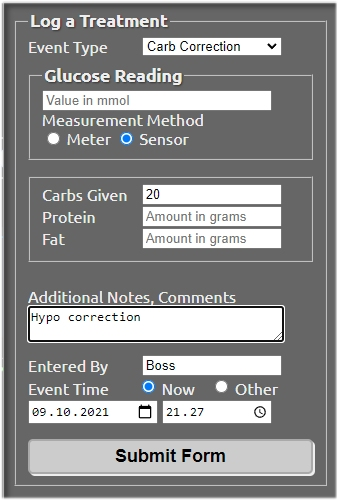

# Declaring meals

Open Careportal by pressing the **"+"** sign on the upper right corner of Nightscout.

You are presented with the option to "Log a Treatment". Next to "Event Type", a drop-down menu lists all items you can choose from. Let's assume you want to enter some carbs due to a low glucose value. 

1. Select "Carb Correction"
2. Under Glucose Reading, leave the filed blank, and instead tick the "Sensor" box.
3. Next to Carbs Given, enter 20
4. Protein and Fat are unaccounted for, so leave then blank
5. Add Notes (optional)
6. Entered By : enter your initials, or anything identifying you as the author of the entry
7. Select the correct time for the entry
8. Submit the form. You will be prompted to review the details and accept.

