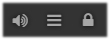

# Overview

You will have to declare meals, mealtime insulins and long-acting insulin agonists in Nightscout, in order for CGMSIM to make calculations. For this, you will have to authorize the device, on which you declare these events. 
 

## Careportal

On the top right corner of your Nightscout website, you should see a lock. 

Click on the lock and you will be prompted to enter your APISECRET 

Tick the "Remember this device", so you won't have to do this every time, and click **Authenticate**. You will have to repeat this step whenever you open your Nightscout website on a different browser or device.

When it's done, the lock on the upper-right corner has been replaced with a "+" mark.

Let's move on to [declare our first meal](meals.md).

